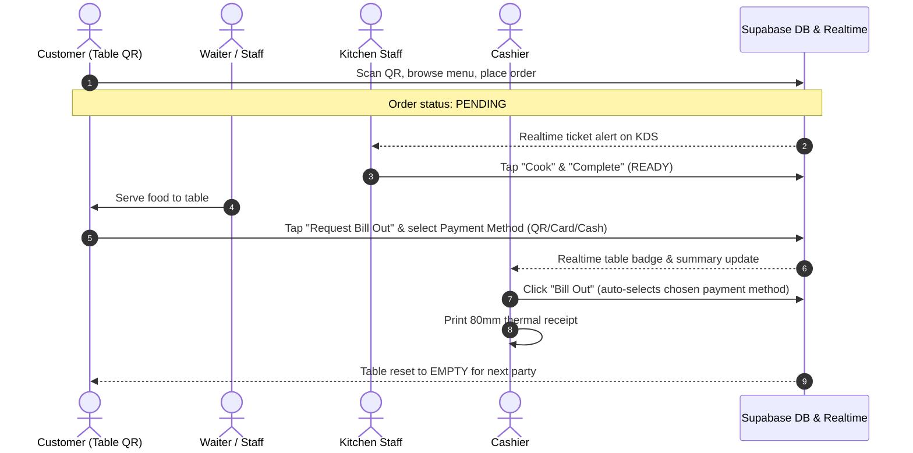

# Servio POS System Documentation

This document provides a comprehensive overview of the Servio Point-of-Sale (POS) system. It explains the system architecture, database schema, real-time synchronization, UI scaling system, and detailed workflows for each terminal interface.

---

## 1. System Architecture

Servio is a real-time, touch-optimized web-based POS system designed for restaurant operations:
- **Frontend**: React (bootstrapped with Vite) for responsive, touch-friendly interfaces.
- **Routing**: `react-router-dom` for navigation between role-specific terminals (Cashier, Kitchen, Waiter, Customer, Admin, Inventory, Restaurant Management) and authentication guards.
- **Backend & Database**: Supabase (PostgreSQL) handles relational data persistence, Row-Level Security (RLS), and Realtime WebSocket subscriptions (`postgres_changes` and peer `broadcast`).
- **Serverless API**: A serverless function (`/api/protocol-assistant`) powers the AI Protocol Assistant, hosted on Vercel.
- **State Management**: Centralized React Contexts (`POSContext.jsx` and `AuthContext.jsx`) manage live tables, orders, inventory, customer requests, payment selections, and cross-tab communication.
- **Thermal Printing**: Direct 80mm thermal receipt generation engine configured for standard POS thermal printers.
- **Deployment**: Hosted on **Vercel** with SPA rewrites (`vercel.json`). Build output is generated in `dist/` via `npm run build`.

---

## 2. Database Schema

Hosted on Supabase PostgreSQL:

- **`profiles`**: Staff credentials, assigned roles (`Admin`, `Cashier`, `Waiter`, `Kitchen`), and active status.
- **`categories`**: Menu categories (e.g., Appetizers, Food, Drinks, Desserts, Meals & Combos).
- **`menu_items`**: Menu catalog items with price, category link, description, image URL, and stock status (`AVAILABLE`, `SOLD_OUT`).
- **`restaurant_tables`**: Physical table registry tracking table number, seating capacity, current status (`EMPTY`, `OCCUPIED`, `RESERVED`), current bill, discount flags, session start timestamps, and `bill_out_requested` flag.
- **`orders`**: Active and archived table orders tracking table number, server name, order type (Dine-in / Takeout), total amount, and lifecycle status (`PENDING`, `IN_PROGRESS`, `READY`, `COMPLETED`, `CANCELLED`).
- **`order_items`**: Itemized lines per order including quantity, item price, individual discount flags, and item preparation status.
- **`customer_requests`**: Self-service guest order batches from QR code ordering. Tracks table number, items JSON, subtotal, status (`PENDING`, `ACCEPTED`, `UNAVAILABLE`, `CANCELLED`), kitchen rejection details, and bill-out requests with customer payment method choice.
- **`ingredients`**: Raw inventory tracking current stock quantity, low-stock threshold, unit of measurement, and unit cost.
- **`recipe_ingredients`**: Relational mapping linking menu items to ingredients for automated recipe-based inventory deductions upon order punch.

---

## 3. Core State & Real-time Architecture

### `AuthContext.jsx`
Manages user authentication and session persistence with Supabase Auth.
- Eagerly initializes session on startup via `supabase.auth.getSession()` to eliminate routing race conditions.
- Subscribes to `onAuthStateChange` for real-time multi-tab session coordination.
- Exposes `user`, `profile`, `isAuthenticated`, `authLoading`, `login`, and `logout`.

### `POSContext.jsx`
The primary operational state engine of the system:
1. **Eager & Fallback Data Synchronization**:
   - Subscribes to Supabase Realtime channels for instant updates on `orders`, `order_items`, `restaurant_tables`, `menu_items`, `ingredients`, and `customer_requests`.
   - Utilizes peer-to-peer WebSocket broadcast events (e.g., `bill-out-requested`) for instant sub-millisecond sync across terminals.
   - Features a 3-second polling fallback ensuring data integrity across network drops or background tab throttling.
2. **Bill-Out & Payment State (`tableBillOutPayments`)**:
   - Tracks customer-requested payment methods (`cash`, `credit`, `qr` / InstaPay QR) per table.
   - Synchronized across browsers via Supabase Realtime broadcast and local storage persistence.
   - Automatically cleaned up when tables are cleared or billed out.
3. **Inventory Auto-Deduction**:
   - Order submission automatically queries `recipe_ingredients` and decrements stock levels in `ingredients`.

---

## 4. UI Sizing & Touch Screen System (`SIZE: Std | Large | XL`)

Servio includes a dedicated UI scaling engine built for touch screen POS terminals (tablets, touch monitors, all-in-one POS units):

- **Scale Modes**:
  - `Std` (Standard layout, high information density)
  - `Large` (+12% to +18% font and button sizing, generous touch targets)
  - `XL` (+25% to +35% font and button sizing, high visibility for wall-mounted or high-pace stations)
- **Non-Scrolling Architecture**:
  - Scaling specifically enlarges typography, interactive badges, touch buttons, and tap targets without introducing full-page scrollbars or breaking flex/grid layouts.
- **Persistence**:
  - Sizing preferences are saved per terminal in `localStorage` (`servio_ui_scale`) and apply immediately on load.
- **Touch-Friendly Modals**:
  - Logout confirmation and critical dialogs feature thickened vertical action buttons designed for fingertip activation.

---

## 5. Thermal Receipt Printing (Standard 80mm Roll Format)

The system includes a dedicated receipt printing pipeline designed specifically for POS thermal printers (Epson, Star Micronics, Rongta, Munbyn, Xprinter, Sunmi, etc.):

1. **Standard 80mm Paper Specifications**:
   - Page dimensions defined as `@page { size: 80mm auto; margin: 0; }`.
   - Printable body constrained to `80mm` width with `4mm 3mm` thermal padding.
   - High-contrast pure black `#000000` on `#ffffff` background with dashed dividers for crisp thermal head burning.
2. **Isolated Print Iframe Engine**:
   - Bypasses parent DOM styling and React tree encapsulation by generating an isolated hidden iframe with thermal-specific HTML/CSS.
   - Eliminates blank paper output caused by SPA layout clipping or print style conflicts.
   - Automatic fallback to `window.print()` if iframe printing is restricted.
3. **Authentic Thermal Content Layout**:
   - **Header**: Store title (`SERVIO`), POS identification, and official receipt label.
   - **Metadata**: Table number, date/time, selected payment method, and completion status.
   - **Itemized Columns**: Formatted columns (`ITEM`, `QTY`, `PRICE`, `TOTAL`) with indented item discount tags.
   - **Totals**: Subtotal, item discounts, table-level discounts, double-dashed divider, and bold grand total.
   - **Footer**: Appreciation message, visit note, and `*** CUSTOMER COPY ***`.
4. **On-Screen Thermal Preview**:
   - Displays an authentic 80mm receipt roll modal (`360px` preview width) with monospace typography before printing.

---

## 6. Application Interfaces

### 🔐 Login Interface (`/login`)
- Authenticates staff via Supabase credentials.
- Persists session and redirects authenticated users to the central selector.

### 🎛️ Interface Selector (`/`)
- Central launcher displaying tiles for Cashier, Kitchen, Waiter, Admin, Inventory, and Restaurant Management.
- Features touch size selector (`Std`, `Large`, `XL`) and secure logout confirmation.

### 🛒 Customer Self-Service Interface (`/customer/:tableId`) — *Public*
- Accessed via table QR codes without staff authentication.
- **Menu Browsing & Search**: Filter by category, real-time search, item customization notes, and quantity selectors.
- **Real-Time Sold-Out Sync**: Sold-out items are visually crossed out and disabled from cart addition.
- **Live Order Tracking**: Displays live preparation progress (`Preparing`, `Ready`, `Food Served`).
- **Bill Out Request Modal**:
  - Once food is served, guests can request the bill and choose their preferred payment method:
    - 💵 **Cash**
    - 💳 **Credit Card**
    - 📱 **InstaPay QR**
  - Confirmed requests immediately alert the cashier and update the guest banner.

### 👨‍🍳 Kitchen Display System (KDS) (`/kitchen/active-orders`)
- Touch-screen order rail displaying incoming tickets in real-time.
- Visual wait timers, item checklist, and one-tap order completion.
- Quick stock drawer to toggle menu item availability (`AVAILABLE` / `SOLD OUT`).

### 💵 Cashier Interface (`/cashier/overview`)
- **Tables Grid**: Overview of all tables with occupancy timers and bill-out alerts (`🧾 QR`, `🧾 Card`, `🧾 Cash`).
- **Counter Menu Ordering**: Full ordering workflow for walk-in or counter service.
- **Order Summary**: Displays detailed charges, applied discounts, and the customer's **Requested Payment Method**.
- **Auto-Selected Bill Out**:
  - Opening the payment modal automatically pre-selects the customer's requested payment method with a `Customer Choice` badge.
  - Supports Cash, Credit Card, and InstaPay QR.
- **80mm Thermal Receipt Printing**: Instant print trigger producing standard 80mm thermal receipts.

### 🍽️ Waiter Interface (`/waiter/menu-ordering`)
- Floor terminal for table-side order entry, table switching, and fast item punching.

### 📋 Restaurant Management (`/restaurant-management/edit-menu`)
- Menu catalog editor for adding, modifying, and pricing menu items and categories.
- Table layout manager for configuring table capacities and counts.

### 📦 Inventory Interface (`/inventory`)
- Stock control dashboard for raw ingredients.
- Low-stock visual thresholds, unit management, and cost tracking.

### 📊 Admin Dashboard (`/admin`)
- Executive performance summary: daily revenue, order volume, occupied tables, and inventory warnings.
- Staff profile management: invite and register staff accounts securely.

### 🤖 AI Protocol Assistant
- Chat assistant accessible to staff for operational and safety guidelines (emergency response, hygiene, complaints).
- Reads protocol documents from `/Protocols` and queries the serverless assistant API.

---

## 7. End-to-End Operational Lifecycle



---

## 8. Deployment & Environment Configuration

### Environment Variables

| Variable | Scope | Purpose |
|---|---|---|
| `VITE_SUPABASE_URL` | Client (Vite) | Supabase project endpoint URL. |
| `VITE_SUPABASE_ANON_KEY` | Client (Vite) | Public anonymous key for client requests. |
| `LLM_API_KEY` | Serverless API | Secret API key for AI Protocol Assistant. |
| `LLM_BASE_URL` | Serverless API | (Optional) LLM provider endpoint URL. |
| `LLM_MODEL` | Serverless API | (Optional) Model name (default `gpt-5.4`). |

---

## 10. System-Generated "Best Sellers" Category

### Overview
A permanent, system-generated menu category titled **`🔥 Best Sellers`** is rendered at the top/beginning of all menu views (Customer Mobile & Desktop, Cashier Menu Ordering).

### Dynamics & Features
1. **All-Time Sales Tracking & Category Representation**:
   - Every item ordered or accepted automatically increments its all-time purchase counter.
   - The permanent **"🔥 Best Sellers"** category aggregates the **top 3 items from each category** (Food, Drinks, Desserts, Appetizers, etc.), ensuring balanced representation across the full menu.
   - Only the single overall **`#1 Best Seller`** across all categories is labeled with the rank badge in the Best Sellers category.
2. **Category-Specific #1 Best Seller Indication**:
   - When browsing any specific category (e.g. Food, Drinks, Desserts, Appetizers), the single #1 best-selling item of that specific category is also indicated with the prominent **`🔥 #1 Best Seller · [count] sold`** badge and golden card highlight.
   - Other items within the category are displayed without rank numbers.
3. **Prominent Glowing Aura**:
   - Styled with radiant amber gradients (`linear-gradient(135deg, #f59e0b 0%, #ea580c 45%, #e11d48 100%)`) and continuous dual CSS keyframe animations (`customer-bestseller-glow` and `customer-bestseller-shimmer`).
   - Features elevated padding, high-contrast typography, and a glowing star indicator (`★`), ensuring maximum visual prominence.
3. **Admin Clear / Reset Control**:
   - Located in the Admin Dashboard (`/admin`), the **"🔥 Clear Best Sellers"** button allows administrators to clear all sales counters with a dedicated confirmation modal.
   - Broadcasts `best-sellers-reset` via Supabase Realtime WebSocket to synchronize across all connected cashier and customer devices immediately.
   - When cleared, interfaces display a clean empty state until new orders are placed.
   - Includes a **"Restore Defaults"** control in Admin for testing.

---

## 11. Customer Interface Mobile Layout

### Key Rules & Behaviors
1. **Sidebar Actions in Mobile Mode**:
   - On screens `<= 900px`, the right sidebar stacks below the menu grid.
   - Action buttons ("✓ Mark Pending", "🧾 Request Bill Out", and "Food has been served!") inside `.customer-sidebar` are hidden via `display: none !important;` to avoid clutter and redundancy.
   - All order placement and billing requests on mobile are exclusively handled by the fixed bottom mobile bar (`.customer-mobile-bar`).
2. **Live Order Tracking**:
   - Positioned cleanly at the top of the stacked sidebar directly below the menu, with zero gap above it.
   - A sticky header badge (`🍳 [count]/[total] ready ↓`) appears in the topbar on mobile when active orders exist, allowing customers to tap and scroll smoothly to live tracking.
   - The stacked sidebar has dynamic bottom padding (`max(220px, calc(180px + env(safe-area-inset-bottom)))`) ensuring the fixed bottom bar never overlaps cart items or order tracking details.

---

## 12. Menu Item Image Upload & Storage Architecture

### Overview
Servio features a resilient, high-performance dish image uploading pipeline embedded directly inside the **Menu Manager** (`/menu-manager`). Managers can upload dish photos via drag-and-drop or file selection, which are automatically compressed, persisted to the database/storage, and rendered across all customer and cashier ordering views.

### Architectural Workflow
1. **Client-Side Compression & Optimization (`src/lib/imageUpload.js`)**:
   - High-resolution camera photos (often 5MB–15MB) are automatically downsampled and compressed in the browser using HTML5 Canvas (`compressImage`).
   - Images are resized to a maximum bounding box of `800x800` pixels at `0.82` JPEG quality.
   - File sizes are reduced to ~40KB–90KB, eliminating upload latency, preventing network timeouts, and ensuring rapid rendering across mobile devices.

2. **Dual-Mode Persistence Strategy (`uploadMenuItemImage`)**:
   - **Primary (Supabase Storage)**: Uploads the compressed image file to the `menu-items` public storage bucket in Supabase Storage (`supabase.storage.from('menu-items').upload(...)`), returning a persistent public CDN URL (`getPublicUrl`).
   - **Automatic Fallback (Data URI)**: If the Supabase Storage bucket has not yet been created, or if Row Level Security (RLS) policies prevent access, the system automatically falls back to embedding the compressed Base64 Data URL directly into `menu_items.image_url`. This guarantees zero downtime and enables image uploading out-of-the-box without requiring immediate database migration execution.

3. **Multi-Interface Rendering**:
   - **Menu Manager (`/menu-manager`)**:
     - Drag-and-drop file upload zone with hover state and live file validation.
     - Live image preview box with instant **Change Picture** and **Remove Picture** controls.
     - Card grid preview showing actual dish photos with status overlay (`Active` / `Inactive`).
     - Fast keyword search autosuggest dropdown displaying dish thumbnails.
     - Delete confirmation dialog with dish photo preview.
   - **Customer QR Ordering (`/customer/:tableId`)**:
     - Displays dish images in the customer menu grid via `<MenuImageDisplay />` with shimmering skeleton placeholder during loading and error fallback.
   - **Cashier Counter Ordering (`/cashier/overview`)**:
     - Renders dish photos in the 12-item paged menu card grid (`.menu-item-photo`) and interactive search dropdown (`.menu-keyword-photo`).

### Database & Storage SQL Migration
To configure Supabase Storage for production, execute the migration script located at `supabase/migrations/20260904_menu_item_images_storage.sql` in the Supabase SQL Editor:

```sql
-- 1. Ensure image_url column exists
ALTER TABLE public.menu_items ADD COLUMN IF NOT EXISTS image_url TEXT;

-- 2. Create public 'menu-items' bucket
INSERT INTO storage.buckets (id, name, public, file_size_limit, allowed_mime_types)
VALUES (
  'menu-items',
  'menu-items',
  TRUE,
  5242880,
  ARRAY['image/jpeg', 'image/png', 'image/webp', 'image/gif', 'image/svg+xml']
)
ON CONFLICT (id) DO UPDATE SET
  public = TRUE,
  file_size_limit = EXCLUDED.file_size_limit,
  allowed_mime_types = EXCLUDED.allowed_mime_types;

-- 3. Storage Policies for public read and authorized upload
CREATE POLICY "Public Access for menu-items bucket"
ON storage.objects FOR SELECT
USING (bucket_id = 'menu-items');

CREATE POLICY "Allow upload to menu-items bucket"
ON storage.objects FOR INSERT
WITH CHECK (bucket_id = 'menu-items');

CREATE POLICY "Allow update to menu-items bucket"
ON storage.objects FOR UPDATE
USING (bucket_id = 'menu-items')
WITH CHECK (bucket_id = 'menu-items');

CREATE POLICY "Allow delete from menu-items bucket"
ON storage.objects FOR DELETE
USING (bucket_id = 'menu-items');
```

---

## 13. Customer Table Assistance System

Servio provides an instant, bidirectional table assistance workflow connecting dining guests directly with the Cashier terminal and Table Management (`/table-manager`).

### Architecture & Real-Time Synchronization
1. **Customer Request Dispatch**:
   - Customers trigger assistance requests from `/customer/:tableId` via the persistent **Floating Action Button (FAB)** that stays pinned on the screen during scrolling.
   - A modal allows selecting common presets:
     - 🛎️ *Call Waiter / Staff*
     - 💧 *Water Refill*
     - 🍴 *Utensils & Napkins*
     - 💳 *Bill Inquiry*
     - 💬 *Other* (with custom note input)
   - When submitted:
     - Local state tracks the request with active pulsing badges and an auto-dismiss feedback toast.
     - A Supabase Realtime broadcast event (`table-assistance-requested`) is dispatched across all connected terminals.
     - The table record in `restaurant_tables` is updated with `status = 'REQUEST'`.
     - Customers can cancel or resolve the request at any time directly from their screen.

2. **Cashier Terminal Alerting (`/cashier/overview`)**:
   - The Cashier overview displays an alert banner at the top of the table management area whenever any table has an active assistance request.
   - The banner summarizes the table number, request type, note, and provides a direct shortcut to select the table.
   - Table cards display a pulsating `🛎️ Assistance` badge.
   - Selecting the table displays an assistance callout in the inspector panel with a **✓ Acknowledge & Clear Assistance** action.

3. **Table Management Screen (`/table-manager`)**:
   - An alert banner displays all pending table assistance requests with a quick **✓ Mark Assisted** resolution button.
   - Table cards glow with an animated pulse and display an assistance badge.
   - The Status Key count for `REQUEST` updates in real time.
   - Editing a table displays a customer assistance notice and allows adjusting status.

4. **Resolution & State Restoration**:
   - When staff resolve the assistance request (from either Cashier, Table Management, or Customer interface):
     - Supabase Realtime broadcasts `table-assistance-resolved`.
     - The table status is restored intelligently: if the table still has active, unfinished orders, it reverts to `OCCUPIED`; otherwise, it returns to `EMPTY`.
     - All banners and pulsing indicators clear instantly across all devices without requiring page refreshes.
